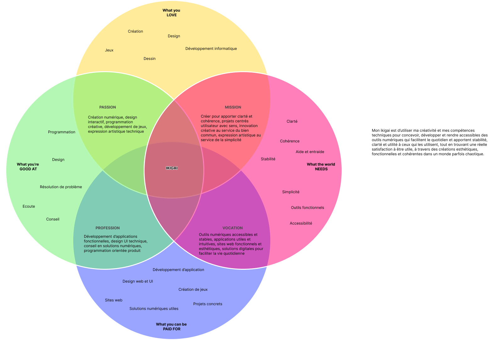

Bonjour, je m'appelle **Anna Tranchida**.
Je suis étudiante en **Ingénierie des Médias** à **l'HEIG-VD**.

---

## Mon Ikigai

## Mon Domaine

### Conception et développement d’expériences numériques
Je me concentre sur les applications, sites web et outils interactifs alliant **design UX/UI** et **développement**.

> **Pourquoi ?**
> C'est pour moi l'intersection idéale entre créativité, design et technologie pour créer des outils numériques concrets et utiles au quotidien.

### Mots-clés
* Création numérique
* UX/UI & Design d’interaction
* Accessibilité & Performance
* Prototypage & Tests utilisateurs
* Design systems
* Développement web & Jeux
* Solutions numériques utiles

### Sous-domaines
1. **Design d’interface et d’interaction**
2. **Design systems et guidelines**
3. **Développement frontend** (web/app/jeux)
4. **Accessibilité**
5. **Recherche UX et amélioration continue**

---

## Taxonomies

Pour organiser ma veille sur ce site, j'utilise deux systèmes de classement principaux :

* **[Les catégories](/categories/)** : Les grands thèmes de mes recherches.
* **[Les tags (Étiquettes)](/tags/)** : Les mots-clés spécifiques pour retrouver des concepts précis.

---

## Comment j'ai fait ce site

Ce site est un **site statique** conçu pour être rapide, sécurisé et facile à maintenir.

* **Générateur :** [Hugo](https://gohugo.io/), un framework open-source ultra-rapide.
* **Thème :** [Stack](https://github.com/CaiJimmy/hugo-theme-stack), choisi pour son design en cartes et sa lisibilité.
* **Hébergement :** Le code est versionné via Git.
